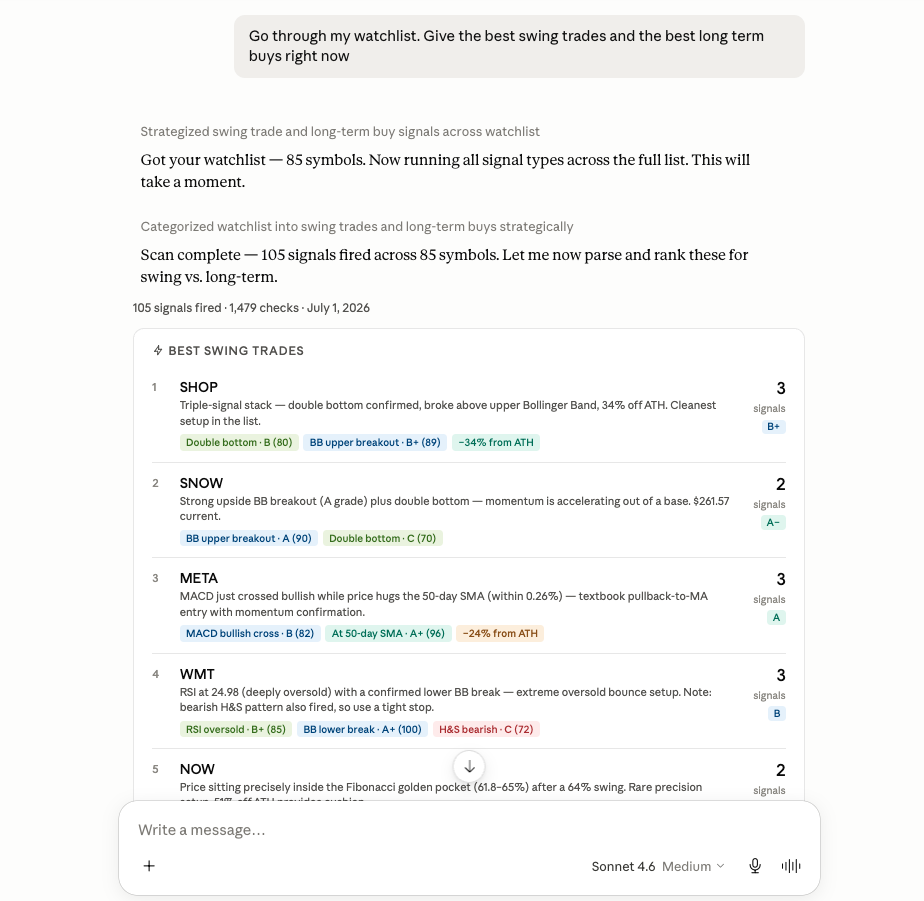

<h1 align="center"> Horus MCP </h1>

<p align="center">
  MCP server for signal scanning and stock market research. Provides price lookups, technical indicators, watchlists, chart tools, and custom signals. 
</p>

<p align="center">
  <a href="#quick-setup">Quick start</a> | 
  <a href="#tools">Tools</a>
</p>

<p align="center">
  
</p>

## Features

- Look up current prices, market snapshots, options, gainers, and losers
- Compute indicators such as RSI, MACD, moving averages, beta, and distance from all-time high
- Save reusable signals (eg bull flag, MACD bullish crossover, cup & handle, golden pocket) and scan watchlists, custom ticker lists, or entire exchanges
- Run scans in the background and poll for status/results later
- Generate PNG charts for price action, overlays, relative strength, fundamentals, forward returns, breadth, drawdowns, and more
- Expose MCP resources for recent alerts, watchlist symbols, and forward-return research
- Connect to your favorite client: Claude Desktop, Openclaw, Hermes etc. See specific setup instructions for popular clients [here](#connecting-an-mcp-client)

## Prerequisites

You need:

- Python 3.11 or newer: https://www.python.org/downloads/

Notes:

- Charts are exported with `kaleido`, which is installed automatically with the Python dependencies.
- The app stores its database at `~/.scanner_mcp/data.db` by default.

## Quick Setup

```bash
cd /path/to/horus-mcp
python3.11 -m venv .venv
source .venv/bin/activate
pip install -e .
horus-mcp
```

Windows PowerShell:

```powershell
cd C:\path\to\horus-mcp
py -3.11 -m venv .venv
.venv\Scripts\Activate.ps1
pip install -e .
horus-mcp
```

## Step-By-Step Local Setup

<details>
<summary>Show full beginner-friendly setup steps</summary>

### 1. Download the project

Download or clone this repo.

### 2. Open a terminal in the project folder

Change into the project directory:

macOS / Linux:

```bash
cd ~/Projects/horus-mcp
```

Windows PowerShell:

```powershell
cd C:\Users\YourName\Projects\horus-mcp
```

### 3. Create a virtual environment

This keeps the project isolated from the rest of your device.

macOS / Linux:

```bash
python3.11 -m venv .venv
```

Windows PowerShell:

```powershell
py -3.11 -m venv .venv
```

If that does not work, try `python3 -m venv .venv` or `python -m venv .venv`.

### 4. Activate the virtual environment

macOS / Linux:

```bash
source .venv/bin/activate
```

Windows PowerShell:

```powershell
.venv\Scripts\Activate.ps1
```

When it is active, you will see `(.venv)` at the beginning of the terminal prompt.

### 5. Install the project

Run:

```bash
pip install -e .
```

This installs the dependencies and the `horus-mcp` command.

### 6. Start the server

Run:

```bash
horus-mcp
```

The server uses MCP `stdio` transport by default. Most MCP clients should launch this same command internally rather than having you run it manually in a separate terminal.

</details>

## MCP Inspector

For interactive MCP debugging, first ensure the venv is activate with the above steps. Then run:

```bash
npx @modelcontextprotocol/inspector horus-mcp
```

## Connecting an MCP Client

Most clients need the full path to the installed `horus-mcp` executable inside `.venv`.

### Claude Desktop

1. Finish the setup steps above.
2. Open the Claude Desktop MCP config file:
   - macOS: `~/Library/Application Support/Claude/claude_desktop_config.json`
   - Windows: `%APPDATA%\Claude\claude_desktop_config.json`
3. Add a `horus-mcp` server entry under `mcpServers`.
4. Restart Claude Desktop.

Example config on macOS:

```json
{
  "mcpServers": {
    "horus-mcp": {
      "command": "/Users/yourname/Projects/horus-mcp/.venv/bin/horus-mcp",
      "args": []
    }
  }
}
```

Example config on Windows:

```json
{
  "mcpServers": {
    "horus-mcp": {
      "command": "C:\\Users\\yourname\\Projects\\horus-mcp\\.venv\\Scripts\\horus-mcp.exe",
      "args": []
    }
  }
}
```

If your MCP client has trouble finding the executable, use Python directly instead:

macOS / Linux:

```json
{
  "mcpServers": {
    "horus-mcp": {
      "command": "/Users/yourname/Projects/horus-mcp/.venv/bin/python",
      "args": ["-m", "scanner_mcp"]
    }
  }
}
```

Windows:

```json
{
  "mcpServers": {
    "horus-mcp": {
      "command": "C:\\Users\\yourname\\Projects\\horus-mcp\\.venv\\Scripts\\python.exe",
      "args": ["-m", "scanner_mcp"]
    }
  }
}
```

### Cursor

Cursor uses the same JSON format as Claude Desktop. Place it in `~/.cursor/mcp.json` (global, all projects) or `<project>/.cursor/mcp.json` (project-scoped). You can also add it via **Settings > Tools & MCP > New MCP Server**.

```json
{
  "mcpServers": {
    "horus-mcp": {
      "command": "/Users/yourname/Projects/horus-mcp/.venv/bin/horus-mcp",
      "args": []
    }
  }
}
```

### Codex CLI

Codex uses TOML, not JSON. Edit `~/.codex/config.toml` (or a project-scoped `.codex/config.toml`):

```toml
[mcp_servers.horus-mcp]
command = "/Users/yourname/Projects/horus-mcp/.venv/bin/horus-mcp"
args = []
```

Or add it from the CLI:

```bash
codex mcp add horus-mcp -- /Users/yourname/Projects/horus-mcp/.venv/bin/horus-mcp
```

### OpenClaw

OpenClaw uses JSON but nests servers under `mcp.servers` (not `mcpServers`). Edit `~/.openclaw/openclaw.json` and restart OpenClaw:

```json
{
  "mcp": {
    "servers": {
      "horus-mcp": {
        "command": "/Users/yourname/Projects/horus-mcp/.venv/bin/horus-mcp",
        "args": []
      }
    }
  }
}
```

### Hermes Agent

Hermes uses YAML. Add the server under `mcp_servers` in your `config.yaml`:

```yaml
mcp_servers:
  horus-mcp:
    command: "/Users/yourname/Projects/horus-mcp/.venv/bin/horus-mcp"
    args: []
```

### Python fallback (all clients)

If any client cannot find the `horus-mcp` executable, point `command` at the venv's Python and run the module instead. For example, in JSON clients:

```json
{
  "command": "/Users/yourname/Projects/horus-mcp/.venv/bin/python",
  "args": ["-m", "scanner_mcp"]
}
```

Adapt the same `command`/`args` pair to the TOML or YAML formats above. On Windows, use the `.venv\Scripts\` path and escape backslashes in JSON (`\\`).

## Configuration

Optional environment variables:

| Variable | What it does | Default |
| --- | --- | --- |
| `SCANNER_MCP_DB` | Path to the SQLite database file | `~/.scanner_mcp/data.db` |
| `SCAN_TIME` | Default daily scan time (Eastern Time, `HH:MM`) assigned to new signals that don't set their own `scan_time` | `16:30` |
| `LOG_LEVEL` | Logging level | `INFO` |
| `SCANNER_MCP_LOG_FILE` | Write logs to a file in addition to stderr | not set |
| `SCANNER_MCP_SCAN_WORKERS` | Worker threads for background scan jobs | `2` |
| `SCANNER_MCP_EXCHANGE_LIST_TTL` | Cache lifetime in seconds for exchange symbol lists | `3600` |
| `SCANNER_MCP_EXCHANGE_MAX_SYMBOLS` | Optional cap on exchange universe size | not set |
| `ALPHA_VANTAGE_API_KEY` | Enables Alpha Vantage fundamentals data where used | not set |
| `ENABLE_DEBUG_PNG` | Saves chart debug PNGs when enabled (`1`, `true`, `yes`, `on`) | off |

## Tools

### Market Data

| Tool | Description |
| --- | --- |
| `debug_quote` | Debug helper for one symbol: raw quote fields, recent history, and resolved price fields. |
| `get_price` | Current or latest price, previous close, day change, volume, and market cap. |
| `get_indicators` | Technical indicators with per-indicator ratings and a consensus summary. |
| `get_ath_distance` | Percent below all-time high using full available history. |
| `get_option_chain` | Options chain preview for a ticker, with optional expiry date. |
| `market_snapshot` | Snapshot of major US indices, ETFs, crypto, and volatility symbols. |
| `top_gainers` | Top daily gainers for `NYSE`, `NASDAQ`, `AMEX`, or `CRYPTO`. |
| `top_losers` | Top daily losers for `NYSE`, `NASDAQ`, `AMEX`, or `CRYPTO`. |

### Signals And Scans

| Tool | Description |
| --- | --- |
| `list_signal_catalog` | Lists the built-in signal types and their default parameters. |
| `create_signal` | Saves a signal to SQLite for later scanning. |
| `list_signals` | Lists all saved signals. |
| `delete_signal` | Deletes a saved signal and its alert history. |
| `run_scan` | Runs a synchronous scan and returns triggered matches only. Best for smaller jobs. |
| `start_scan` | Starts a background scan job and returns a `job_id` immediately. |
| `get_scan_status` | Returns status and progress counters for a background scan job. |
| `get_scan_result` | Reads the stored results of a completed background scan job. |
| `cancel_scan` | Requests cancellation for a queued or running background scan job. |

### Watchlist

| Tool | Description |
| --- | --- |
| `add_to_watchlist` | Adds ticker symbols to the saved global watchlist. |
| `remove_from_watchlist` | Removes ticker symbols from the saved global watchlist. |
| `get_watchlist` | Returns the current saved watchlist. |

### Charts

All chart tools return a PNG image on success.

| Tool | Description |
| --- | --- |
| `chart_price_history` | Candlestick or line-style price history with optional overlays such as SMA, EMA, Bollinger Bands, MA cloud, Fibonacci retracement, anchored VWAP, and P/E subchart. |
| `chart_price_overlay` | Multi-symbol price comparison, optionally normalized. |
| `chart_ratio` | Ratio chart of one asset divided by another. |
| `chart_relative_strength` | Relative strength chart versus a benchmark with moving average and leadership shading. |
| `chart_sector_rotation` | Sector or ETF comparison with a rolling return panel. |
| `chart_fundamental_overlay` | Price chart with revenue or earnings bars overlaid. |
| `chart_fundamental_momentum` | Multi-panel chart for price, revenue growth, profitability, and valuation. |
| `chart_forward_returns` | Price chart with signal markers plus a forward-return study after historical events. |
| `chart_basket_breadth` | Equal-weight basket vs benchmark with correlation and breadth panels. |
| `chart_pairs_spread` | Pairs chart with spread or ratio plus z-score bands. |
| `chart_drawdown_comparison` | Drawdown comparison across multiple symbols. |
| `chart_log_cycle` | Long-term log-scale cycle chart, useful for assets like BTC. |

## MCP Resources

| Resource | Description |
| --- | --- |
| `signals://triggered` | Recent triggered alerts as JSON. |
| `signals://watchlist` | Current watchlist symbols as JSON. |
| `research://forward-returns/{symbol}/{event_type}` | Markdown forward-return summary for a symbol and event type. |


## Disclaimer

This project is for research and tooling only. It is not financial advice.
